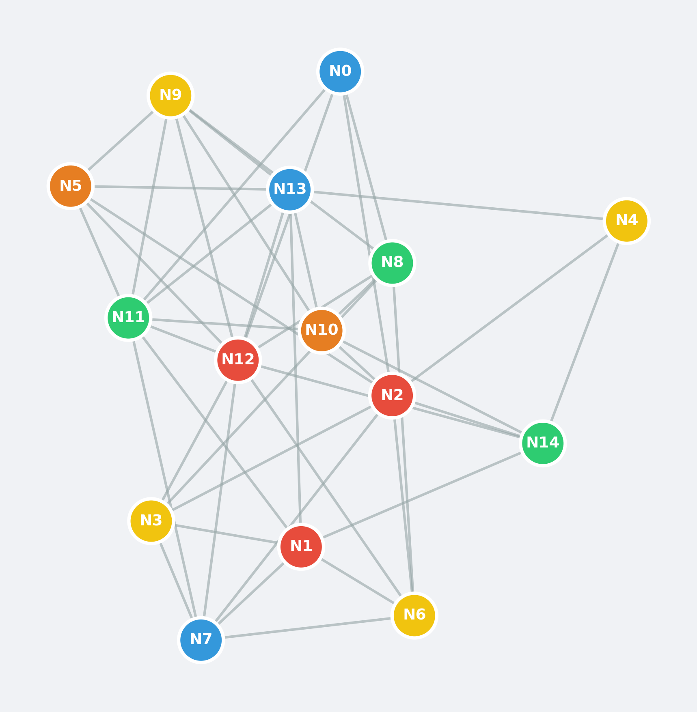

# 🎨 Ứng Dụng Tô Màu Đồ Thị (Graph Coloring Visualization)

Đây là đồ án mô phỏng bài toán **Tô màu đồ thị (Graph Coloring)** - một bài toán kinh điển trong lý thuyết đồ thị và bài toán thỏa mãn ràng buộc (CSP).

Ứng dụng được viết bằng **Python**, sử dụng thuật toán **Greedy kết hợp Hạ bậc (Degree Reduction)** để giải quyết bài toán và trực quan hóa kết quả bằng giao diện đồ họa.


*(Kết quả chạy thực tế của chương trình)*

## ✨ Tính Năng Nổi Bật

1.  **Tạo Đồ Thị Động:**
    * Tùy chỉnh số lượng đỉnh ($N$) và độ phức tạp (mật độ kết nối).
    * Sử dụng mô hình ngẫu nhiên Erdos-Renyi để sinh đồ thị.
2.  **Hệ Thống Chọn Màu Thông Minh:**
    * **Checkbox:** Chọn màu nhanh chóng bằng cách tích chọn (không cần gõ phím).
    * **Color Picker:** Hỗ trợ thêm hàng triệu màu tùy chọn từ bảng màu Windows.
3.  **Thuật Toán Mạnh Mẽ:**
    * Sử dụng chiến lược **Hạ bậc (Degree Reduction)**: Ưu tiên tô đỉnh bậc cao nhất, sau đó giảm bậc các đỉnh hàng xóm để tối ưu hóa số màu sử dụng.
    * Cơ chế **Hash Color**: Tự động sinh mã màu hiển thị nếu thuật toán trả về màu lạ, đảm bảo chương trình không bao giờ bị lỗi.
4.  **Giao Diện Phẳng (Flat Design):**
    * Thiết kế hiện đại, dễ nhìn, nút bấm phẳng.
    * Hiển thị đồ thị rõ nét với NetworkX và Matplotlib.

## 🛠️ Yêu Cầu Cài Đặt

Bạn cần cài đặt Python và các thư viện sau:

```bash
pip install networkx matplotlib
(Lưu ý: Thư viện tkinter và hashlib thường đã có sẵn trong Python mặc định).🚀 Hướng Dẫn Sử DụngKhởi động: Chạy file main.py.Bashpython main.py
Bước 1 - Cấu hình:Nhập số lượng đỉnh (VD: 10, 15...).Nhập độ phức tạp (0.1 là thưa, 0.8 là dày đặc).Bấm nút "TẠO ĐỒ THỊ".Bước 2 - Chọn màu:Tích vào các ô màu bạn muốn sử dụng ở bảng bên trái.Nếu muốn thêm màu mới, bấm "+ Thêm màu tùy chọn..." và chọn màu ưng ý.Bước 3 - Tô màu:Bấm nút "THỰC HIỆN TÔ MÀU".Xem kết quả trực quan ở màn hình bên phải.📂 Cấu Trúc Dự ÁnPlaintextDoAnToMau/
├── algorithms.py     # Lõi xử lý: Tạo đồ thị, Thuật toán tô màu Hạ bậc
├── gui_app.py        # Giao diện: Xử lý Checkbox, Color Picker, Vẽ hình
├── main.py           # File chạy chính
├── README.md         # Tài liệu hướng dẫn này
└── images/           # Thư mục chứa ảnh demo
    └── demo_result.png
🧠 Giải Thích Thuật Toán (Degree Reduction)Chương trình hoạt động theo các bước sau:Khởi tạo: Tính bậc (số cạnh nối) của tất cả các đỉnh.Lặp: Tìm đỉnh có bậc lớn nhất trong số các đỉnh chưa tô màu.Tô màu: Gán màu hợp lệ đầu tiên trong danh sách màu đã chọn (không trùng với hàng xóm).Hạ bậc: Sau khi tô xong đỉnh $U$, giảm bậc của tất cả các hàng xóm của $U$ đi 1.Quay lại bước 2 cho đến khi tất cả các đỉnh đều có màu.
Tác giả: [Nguyễn Thị Ngọc-2001230571]
